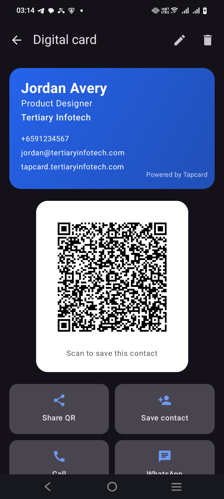
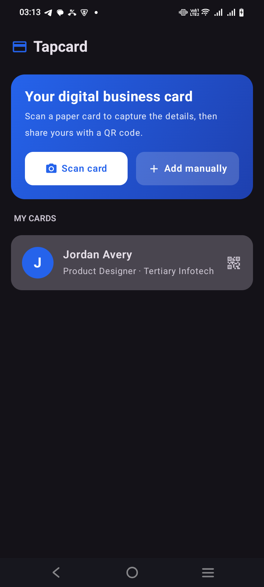
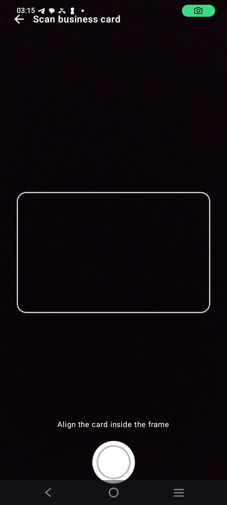
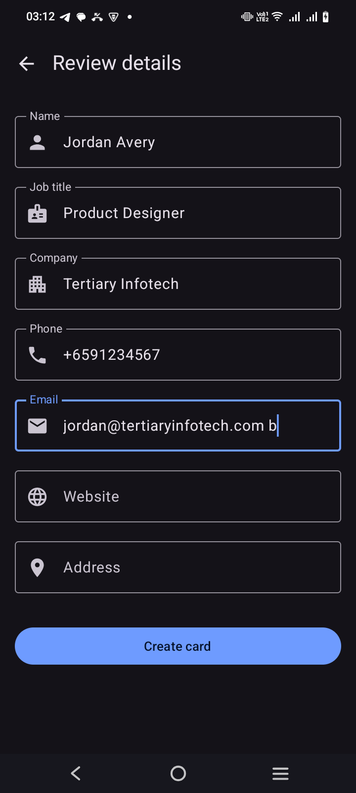

<div align="center">

# Tapcard — Digital Business Card

[](https://www.android.com/)
[](https://kotlinlang.org/)
[](https://developer.android.com/jetpack/compose)
[](https://developers.google.com/ml-kit/vision/text-recognition)
[](https://developer.android.com/about/versions)
[](LICENSE)

**Scan paper business cards, turn them into shareable digital cards with a QR code — all on-device.**

[Website](https://tapcard.tertiaryinfotech.com) · [Report Bug](https://github.com/alfredang/tapcardapp_android/issues) · [Request Feature](https://github.com/alfredang/tapcardapp_android/issues)

</div>

## Screenshot



<div align="center">

| My Cards | Scan | Review | Digital Card |
|:---:|:---:|:---:|:---:|
|  |  |  |  |

</div>

## About

**Tapcard** turns the paper business cards piling up in your drawer into clean, shareable digital
cards — and lets you hand out your own with a single QR code. Point your camera at a card, Tapcard
reads the details **on-device**, you confirm them, and you get a polished digital card you can share,
save, or beam straight into anyone's address book.

It's a native Android companion to the [Tapcard](https://tapcard.tertiaryinfotech.com) digital
business-card platform, built with Jetpack Compose and Material 3.

### Key Features

- 📷 **On-device card scanning** — Google ML Kit text recognition, no network and no API keys
- 🧠 **Automatic field detection** — name, job title, company, phone, email, website, address
- ✏️ **Review & edit** — fix anything before you save; nothing is locked in
- 🔳 **Shareable QR code** — anyone can scan it to save the contact (iPhone, Android, Google, Outlook)
- 👤 **One-tap contact export** — add the card straight to your address book as a vCard
- ⚡ **Quick actions** — call, WhatsApp, email, or open the website right from the card
- 🗂️ **My Cards** — every card you create, stored privately on your device
- ⌨️ **Add by hand** — no card? Type the details in and still get a QR
- 🌗 **Material 3 design** with automatic light & dark mode
- 🔒 **100% private** — no account, no cloud, no ads, no analytics

## Tech Stack

| Category | Technology |
|----------|------------|
| **Language** | Kotlin 2.1 |
| **UI** | Jetpack Compose · Material 3 |
| **Architecture** | MVVM (`AndroidViewModel` + Compose state) |
| **OCR** | Google ML Kit Text Recognition (on-device) |
| **Camera** | CameraX (preview + still capture) |
| **QR codes** | ZXing core |
| **Persistence** | kotlinx.serialization → SharedPreferences |
| **Build** | Gradle 8.11 · AGP 8.10 · compileSdk 36 |

## Architecture

```
┌──────────────────────────────────────────────────────────┐
│                      MainActivity                          │
│                 (Compose + TapcardTheme)                   │
└───────────────────────────┬──────────────────────────────┘
                            │
                  ┌─────────▼─────────┐
                  │    RootScreen     │  Crossfade router
                  └─────────┬─────────┘
        ┌──────────┬────────┼─────────┬───────────┐
        ▼          ▼        ▼          ▼           ▼
     Home       Scan     Review    CardDetail   (alerts)
   (My Cards)  (CameraX)  (edit)   (QR + share)
        │          │        │          │
        └──────────┴────┬───┴──────────┘
                        ▼
              ┌───────────────────┐
              │   CardViewModel   │  single source of truth
              └─────────┬─────────┘
        ┌───────────────┼────────────────┐
        ▼               ▼                ▼
   CardScanner      CardParser        CardStore
  (ML Kit OCR)   (text → fields)   (local JSON)
                                        │
                                   VCard (vCard + QR + share)
```

## Project Structure

```
tapcardapp/
├── app/
│   ├── build.gradle.kts
│   └── src/main/
│       ├── AndroidManifest.xml
│       ├── java/com/tertiaryinfotech/tapcard/
│       │   ├── MainActivity.kt
│       │   ├── TapcardApplication.kt
│       │   ├── model/         # DigitalCard, AppScreen
│       │   ├── ocr/           # CardScanner (ML Kit)
│       │   ├── util/          # CardParser, CardStore, VCard
│       │   ├── vm/            # CardViewModel
│       │   └── ui/            # Home, Scan, Review, CardDetail, theme
│       └── res/               # icons, themes, strings
├── scripts/make_keystore.sh   # release signing helper
├── store/                     # Play Store listing, privacy policy, assets
├── PLAY_STORE_SETUP.md
└── README.md
```

## Getting Started

### Prerequisites

- Android Studio (Ladybug or newer) with Android SDK 36
- JDK 17 (Android Studio's bundled JBR works)
- An Android device or emulator running Android 8.0 (API 26)+

### Build & Run

```bash
git clone https://github.com/alfredang/tapcardapp_android.git
cd tapcardapp_android

# Debug build + install on a connected device
./gradlew :app:installDebug
```

Or open the project in Android Studio and press **Run**.

### Release build

```bash
# 1. Create your upload keystore (once)
./scripts/make_keystore.sh

# 2. Build the signed App Bundle for Play
./gradlew :app:bundleRelease
# → app/build/outputs/bundle/release/app-release.aab
```

See [PLAY_STORE_SETUP.md](PLAY_STORE_SETUP.md) for the full Play Store submission guide.

## Privacy

Tapcard has **no backend**. The camera is used only to photograph a business card, and the text is
read entirely on-device by ML Kit. Cards are stored in the app's private storage and never uploaded.
See [store/privacy-policy.md](store/privacy-policy.md).

## Contributing

Contributions are welcome! Fork the repo, create a feature branch, and open a pull request.

1. Fork the project
2. Create your branch (`git checkout -b feature/amazing-feature`)
3. Commit your changes (`git commit -m 'Add amazing feature'`)
4. Push to the branch (`git push origin feature/amazing-feature`)
5. Open a Pull Request

## Developed By

**Tertiary Infotech Academy Pte. Ltd.**
Singapore · [tertiaryinfotech.com](https://www.tertiaryinfotech.com)

## Acknowledgements

- [Jetpack Compose](https://developer.android.com/jetpack/compose) & [Material 3](https://m3.material.io/)
- [Google ML Kit](https://developers.google.com/ml-kit) — on-device text recognition
- [CameraX](https://developer.android.com/training/camerax)
- [ZXing](https://github.com/zxing/zxing) — QR generation
- Inspired by the [Tapcard](https://tapcard.tertiaryinfotech.com) platform

---

<div align="center">

⭐ If you find this project useful, please consider giving it a star!

</div>
